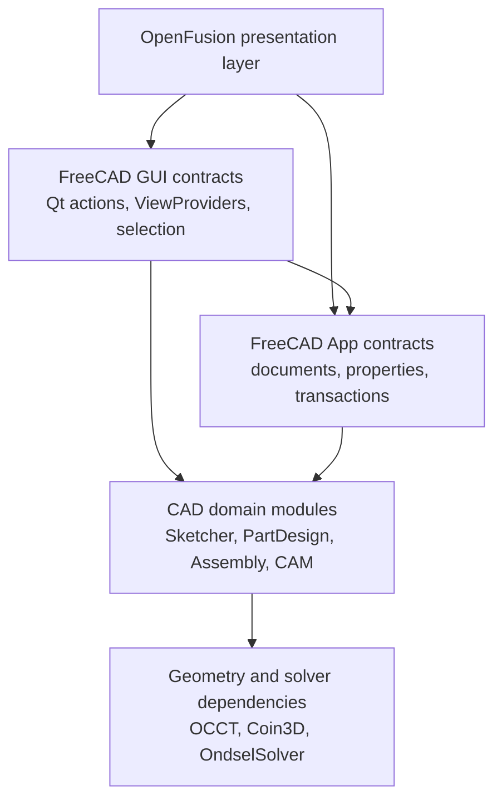
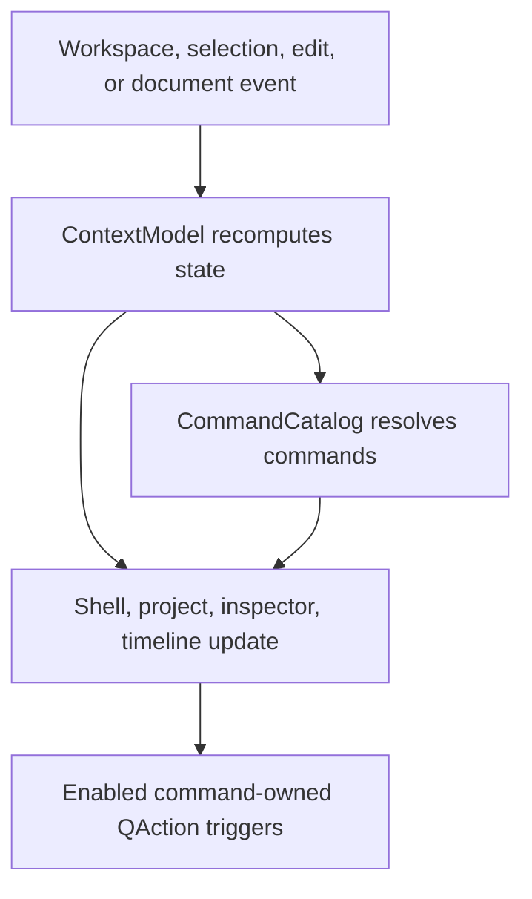

# OpenFusion Architecture

## Status and scope

This document describes the architecture inherited from FreeCAD, the planned
OpenFusion presentation layer, and the compatibility boundaries that must be
preserved while the product is migrated incrementally.

The verified upstream baseline is:

| Field | Value |
| --- | --- |
| Upstream | FreeCAD |
| Release | `1.1.3` |
| Commit | `145529fe741292ff0b3977a01195bf0247425794` |
| Release date | 2026-07-25 |

Paths and class names in the "Current architecture" sections refer to that
baseline. Names in the "Planned OpenFusion layer" sections are architectural
targets, not claims that the corresponding code already exists.

The primary architectural rule is:

> OpenFusion adds a coherent presentation and workflow layer over FreeCAD's
> mature document, geometry, solver, persistence, command, and extension
> contracts. Those contracts are migrated only through small, tested,
> compatibility-preserving changes.

The detailed policy is recorded in
[`docs/adr/0001-upstream-compatibility-boundaries.md`](docs/adr/0001-upstream-compatibility-boundaries.md).

## System layers

Dependencies normally point downward. OpenFusion widgets must not own geometry
or duplicate persisted model state. Domain operations remain authoritative in
their App-layer objects and commands.

## Current FreeCAD architecture

### Process startup and application shell

- `src/Main/MainGui.cpp` is the GUI entry point. It initializes
  `App::Application`, initializes `Gui::Application`, and enters the Qt event
  loop.
- `src/Gui/Application.{h,cpp}` bridges App documents and events into the GUI,
  creates GUI documents and ViewProviders, owns the command manager, and
  coordinates workbench and style initialization.
- `src/Gui/MainWindow.{h,cpp}` provides the singleton `Gui::MainWindow`, a
  `QMainWindow` containing menus, toolbars, docks, a status bar, and a
  `QMdiArea`.
- `src/Gui/MDIView.{h,cpp}` is the base for document views hosted by that MDI
  area. `src/Gui/View3DInventor.*` and TechDraw's page view are concrete
  examples.
- `src/Gui/DockWindow.*`, `src/Gui/ComboView.*`, `src/Gui/Tree.*`,
  `src/Gui/PropertyView.*`, and `src/Gui/TaskView/` implement the existing
  project, property, and task-panel surfaces.

`Gui::MainWindow` and `Gui::Application` remain the host and lifecycle owners.
The first OpenFusion shell must attach to them; it must not create a second Qt
application, MDI owner, or active-document concept.

### Commands, actions, and workbenches

- `src/Gui/Command.{h,cpp}` defines `Gui::CommandBase`, `Gui::Command`, Python
  command variants, and `Gui::CommandManager`.
- `Gui::CommandManager::getAllCommands()`, `getModuleCommands()`,
  `getGroupCommands()`, `getCommandByName()`, `testActive()`, and
  `signalChanged` provide the command-registry seam. `runCommandByName()` is a
  compatibility API, but it is not the launcher dispatch path because it does
  not preserve all QAction-level gating and grouped/checkable semantics.
- `src/Gui/Action.{h,cpp}` bridges commands to `QAction`, including translated
  labels, tooltips, icons, shortcuts, enabled state, and check state.
- `src/Gui/MenuManager.*`, `ToolBarManager.*`, `ToolBoxManager.*`, and
  `DockWindowManager.*` turn command identifiers into shell controls.
- `src/Gui/Workbench.{h,cpp}`, `WorkbenchManager.*`, and `WorkbenchFactory.*`
  manage workbench creation and activation. Module `InitGui.py` files register
  Python workbenches and commands. First activation may lazily import a module.

Command identifiers are already shared by menus, shortcuts, macros, Python
automation, and addons. They are the correct dispatch boundary for OpenFusion
workspaces and command search.

### Documents, transactions, and properties

- `src/App/Application.{h,cpp}` exclusively owns open App documents.
- `src/App/Document.{h,cpp}` owns document objects, the dependency graph,
  recomputation, save/restore, and undo/redo transactions. Relevant seams
  include `topologicalSort()`, `openTransaction()`, `commitTransaction()`,
  `abortTransaction()`, and its object, recompute, and transaction signals.
- `src/App/DocumentObject.{h,cpp}` provides identity, typed properties,
  expressions, dependency access through `getInList()` and `getOutList()`, and
  execution/recompute hooks.
- `src/App/PropertyContainer.*`, `src/App/Property*`,
  `src/App/DynamicProperty.*`, and the extension framework provide reflective,
  serializable model state.
- `src/Gui/Document.{h,cpp}` mirrors an App document, owns its ViewProviders,
  manages edit mode and GUI views, and persists GUI state.
- `src/Gui/ViewProvider*` supplies scene roots, icons, tree children,
  visibility, context actions, drag/drop behavior, and editing behavior for an
  App object.

All user-visible mutations must pass through the existing document and command
transaction mechanisms. A Qt model may cache display data, but it must never
become a second persisted CAD model.

### Project hierarchy, selection, and properties

- The default project browser is `Gui::TreePanel` and `Gui::TreeWidget` in
  `src/Gui/Tree.{h,cpp}`. The widget currently contains substantial hierarchy,
  activation, rename, selection, grouping, search, and drag/drop behavior.
- `Gui::DocumentModel : QAbstractItemModel` in
  `src/Gui/DocumentModel.{h,cpp}` and `Gui::TreeView` already demonstrate a
  model/view representation, but they are not the default project browser.
- ViewProvider `claimChildren()` semantics define much of the user-facing
  hierarchy and must be honored by any replacement model.
- `Gui::SelectionSingleton` in `src/Gui/Selection/Selection.*` is the single
  selection and preselection authority. It supports document objects,
  Face/Edge/Vertex subelements, picked coordinates, selection gates, and
  observers.
- `src/Gui/propertyeditor/` contains the property model, items, delegates, and
  editor factory used by `Gui::PropertyView`.

The OpenFusion browser, viewport, inspector, timeline, and contextual toolbar
must synchronize through `Gui::SelectionSingleton`; no parallel selection
service is permitted.

### Viewport and navigation

- `Gui::View3DInventor` hosts `Gui::View3DInventorViewer` from
  `src/Gui/View3DInventorViewer.*`.
- The viewer uses the bundled Quarter bridge in `src/Gui/Quarter/`, Coin3D
  scene graphs, `SoRenderManager`, and a Qt OpenGL widget.
- ViewProviders populate Coin nodes; Part shape rendering uses
  `src/Mod/Part/Gui/SoBrep*` and related ViewProviders.
- `src/Gui/Navigation/NavigationStyle.*` is a pluggable navigation-policy seam.
- `src/Gui/NaviCube.*` and `src/Gui/NavigationAnimation.*` already implement
  directional cube actions and animated camera changes.
- `src/Gui/Inventor/Draggers/`, `Gui::TaskTransform`, and the Part preview
  extensions provide reusable manipulators and previews.

Navigation profiles, cube styling, overlays, highlight styling, and measured
render improvements are local extension points. Replacing Coin3D/Quarter or
the scene-selection pipeline is not part of the first migration phase.

### Domain modules

| Domain | Authoritative implementation | Architectural note |
| --- | --- | --- |
| Sketching | `src/Mod/Sketcher/App/SketchObject.*`, `Sketch.*`, `planegcs/`, `src/Mod/Sketcher/Gui/` | Geometry and constraint indices are solver and persistence contracts. Improve the UI over existing commands and solver status. |
| Part Design | `src/Mod/PartDesign/App/Body.*`, `Feature.*`, concrete operation classes, and GUI task parameter classes | Body Group order, Tip, BaseFeature chain, preview, and task transaction lifecycle define the feature history. |
| Assembly | `src/Mod/Assembly/App/AssemblyObject.*`, Python joint objects and commands, OndselSolver submodule | Cross-document links, joint property schemas, and solver-driven placements require strict transaction and migration tests. |
| CAM | `src/Mod/CAM/App/` plus `src/Mod/CAM/Path/` Jobs, Ops, tools, simulation, and postprocessors | G-code and postprocessor behavior are safety boundaries. UI capability claims require executed tests. |
| Drawings | Persistent objects in `src/Mod/TechDraw/App/`; `MDIViewPage`, `QGI*`, and ViewProviders in `src/Mod/TechDraw/Gui/` | Keep reference persistence and model/QGraphics synchronization authoritative. |
| Simulation | App objects and Python workflows in `src/Mod/Fem/` | External solver invocation, files, parsers, and numerical validation form a security and correctness boundary. |
| Materials | Physical and Appearance models/managers in `src/Mod/Material/`; render appearance on ViewProviders | Keep engineering material separate from render appearance; expose only renderer-supported effects. |

There is no core Sheet Metal module in this upstream baseline. An external
workbench may be integrated only after separate license, dependency,
maintenance, packaging, and compatibility review.

### Python, addons, persistence, and settings

- `src/App/FreeCADInit.py` discovers module paths and executes module `Init.py`
  files. `src/Gui/FreeCADGuiInit.py` executes `InitGui.py`, registers
  workbenches, and reads `package.xml` metadata.
- `FeaturePython` and `ViewProviderFeaturePython` make Python objects part of
  the document and GUI object systems. Existing addons import `FreeCAD` and
  `FreeCADGui` directly.
- `App::Document` writes the App model to `Document.xml` in FCStd; GUI state is
  persisted separately in `GuiDocument.xml`. Properties and type identifiers
  participate in serialization and restore.
- Import/export handlers register through
  `App::Application::addImportType()` and `addExportType()` and are dispatched
  by the module and GUI I/O layers.
- Preferences use `Base::ParameterGrp` and `Base::ParameterManager` from
  `src/Base/Parameter.*`. Preference pages bind to stable parameter paths.
- Theme infrastructure is in `src/Gui/StyleParameters/` and
  `src/Gui/Stylesheets/`, including YAML parameter sets and shared QSS.
- Localization uses module Qt translation catalogs and runtime retranslation.

`FreeCAD`/`FreeCADGui` imports and existing TypeIds remain compatibility APIs.
OpenFusion may add a facade and aliases but must not remove these names during
the compatibility period.

## Planned OpenFusion presentation layer

The presentation layer will live under a dedicated GUI namespace and source
directory, planned as `src/Gui/OpenFusion/`. It owns Qt presentation state and
workflow composition only.

| Planned component | Responsibility | Uses | Must not own |
| --- | --- | --- | --- |
| `OpenFusion::ShellController` | Install the top frame, workspace selector, contextual command surface, project dock, inspector dock, and timeline dock into `Gui::MainWindow`. | `Gui::Application`, `Gui::MainWindow`, dock and toolbar managers | Documents, MDI views, geometry, or a second event loop |
| `OpenFusion::WorkspaceController` | Present Design, Surface, Assembly, Drawing, Manufacturing, Simulation, and Mesh as coherent workspaces; activate/load backing modules and publish a curated command set. | `Gui::WorkbenchManager`, `Gui::WorkbenchManipulator`, workbench definitions | Replacement command implementations or geometry logic |
| `OpenFusion::CommandCatalog` | Copy stable IDs and translated metadata from commands exposed by the current menu/toolbar action surface; later add explicit providers for real settings pages and workspaces. | `getCommandByName()`, `signalChanged`, `Gui::Action`, menus and toolbars | Raw `Command*`/`QAction*`, hidden callback commands, or copied enabled state |
| `OpenFusion::CommandSearchModel` | Fuzzy search, stable ranking, keyboard navigation, and safe execution through the command-owned action. | `CommandCatalog`, `Command::testActive()`, `Gui::Action` | Direct calls into operation task panels or an independent command dispatcher |
| `OpenFusion::ContextModel` | Derive applicable commands from workspace, selection, active component/body, edit mode, and command active state. | `Gui::SelectionSingleton`, active App/Gui documents, `Command::isActive()` | A second selection or command-state system |
| `OpenFusion::ProjectModel` | Expose document/component/body hierarchy, icons, visibility, rename, activation, valid DnD, filtering, and keyboard navigation. | `Gui::Document`, ViewProviders, `claimChildren()`, `Gui::SelectionSingleton` | Parallel object ownership or inferred link rewrites |
| `OpenFusion::TimelineModel` | Present semantic Body feature order, dependency edges, recompute/error status, selection synchronization, and capability flags. | `PartDesign::Body`, `Part::BodyBase::Group` and `Tip`, `DocumentObject` dependencies, document signals | The undo stack as history, arbitrary feature order, or geometry |
| `OpenFusion::TimelineMutationService` | Execute edit, delete, supported suppression, and validated rollback as named transactions and commands. | Command registry, `App::Document` transactions, Body APIs, `SuppressibleExtension` | Generic suppression/reorder behavior for unsupported object types |
| `OpenFusion::InspectorModel` | Curated geometric, placement, appearance, constraints, metadata, and advanced property views. | Existing App properties and property editors | Shadow property values |

### Shell and workspace event flow

The controller layer subscribes to existing signals and publishes immutable
view state. A UI action returns through `Gui::CommandManager` or a narrowly
typed mutation service that opens one App transaction. The model then emits
the normal document, ViewProvider, and selection signals that refresh every
surface.

### Command search contract

The first launcher indexes only real commands exposed by the current menu and
workbench toolbar action surface. It resolves and stores copied command IDs and
localized metadata, excludes test/internal callbacks, and never retains raw
command or action pointers. Explicit workspace, settings, and recent-command
providers are deferred until each has a real activation/invocation contract.

The catalog rebuilds when `Gui::CommandManager::signalChanged` fires, after a
workbench switch, and on language changes. Before showing results, it refreshes
normal command active state. Before execution, it restores the user's prior
focus, re-resolves the command ID, calls `Command::testActive()`, verifies the
real action is enabled, and triggers the command-owned `QAction`. Disabled
commands can be shown as unavailable, but cannot be invoked through a bypass.

### Timeline contract

The timeline is a semantic view of the persistent feature graph, not a log of
button presses:

- Primary order for a Part Design body comes from its owned Group order.
- The active endpoint comes from `Part::BodyBase::Tip`.
- Dependency indicators come from `DocumentObject::getInList()`,
  `getOutList()`, and document topological order.
- Selection and preselection use `Gui::SelectionSingleton` so the tree,
  viewport, inspector, and timeline agree.
- Recompute, warning, and error presentation follows authoritative document
  and object state.
- Suppress/unsuppress is enabled only for objects whose implementation
  supports `App::SuppressibleExtension` and has tested downstream behavior.
- Rollback changes Body state through validated Body/document APIs inside a
  transaction; it does not delete later objects.
- Delete, edit, and reorder use existing commands when available. Reorder is
  absent unless a feature-specific implementation proves dependency and Tip
  safety.

`App::Document` undo transactions are session command history and are not a
durable feature timeline. They must never be displayed or serialized as one.

## Incremental migration sequence

1. Apply OpenFusion branding through the existing branding seam while keeping
   compatibility names and formats.
2. Install `ShellController` into the existing `Gui::MainWindow` without
   changing App or MDI ownership.
3. Implement `CommandCatalog`, command search, and workspace definitions over
   stable command IDs.
4. Add `ContextModel` and a contextual toolbar driven by selection/edit state
   and command active state.
5. Add read-only `ProjectModel` and `TimelineModel`; prove synchronization
   against the legacy tree and viewport.
6. Add controlled rename, visibility, activation, edit, suppression, and
   rollback one operation at a time, with undo/redo and save/reopen tests.
7. Replace primary legacy panels only after behavior parity tests pass; keep an
   Advanced or compatibility path during migration.
8. Modernize module task panels behind existing Sketcher, PartDesign,
   Assembly, TechDraw, CAM, and FEM operation contracts.
9. Consider deeper kernel, renderer, or persistence changes only through a
   separate ADR, compatibility plan, migration fixtures, and benchmarks.

At every step the repository must still build, existing FCStd documents must
still open without destructive migration, and `FreeCAD` Python automation must
remain available unless a separately approved compatibility decision says
otherwise.

## Verification expectations

Presentation-layer changes require more than widget tests. The minimum test
set for the first slice is:

- command catalog discovers C++ and lazily registered Python commands;
- workspace changes preserve the active document, view, edit state, and
  command enabled state;
- context actions track object and subelement selection without stale state;
- project and timeline selection remain synchronized with the viewport;
- timeline edit/suppression/rollback operations are each one undoable
  transaction and survive save/reopen;
- an upstream-created representative FCStd opens, recomputes, saves a copy,
  and remains readable by the supported upstream version;
- existing `FreeCAD` and `FreeCADGui` imports, macros, and representative addons
  continue to load;
- primary shell surfaces pass keyboard, focus, localization, dark/light, and
  HiDPI checks.

Current tests include Python module suites through `src/App/FreeCADTest.py` and
C++ GoogleTest/QtTest targets under `tests/src`. OpenFusion will extend these
with GUI automation, acceptance FCStd fixtures, visual regression, and package
smoke tests; visual comparison does not replace geometry or persistence tests.
